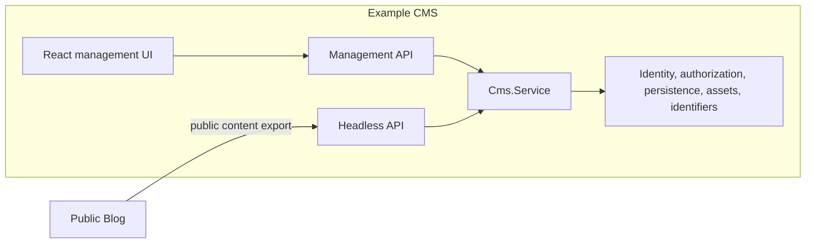

# Contributing to Nearly Headless CMS

This document is for people working inside the repository: library maintainers, reference app authors, and anyone running the full test and acceptance stack.

If you are using the published npm package in your own app, start with the [root README](README.md) and the [package README](packages/nearly-headless-cms/README.md) instead.

## Repository layout



The Example CMS serves its React app, Management API, Headless API, health route, and protected API docs from one Effect/Bun server. It composes the public CMS service with the Bun filesystem adapter and application-specific operations.

The Public Blog is an Astro static site. Its build fetches one validated public content export from the running CMS and uses that snapshot for every page, listing, asset reference, and RSS feed. It imports neither the Example CMS nor `nearly-headless-cms`.

## Workspaces

This Bun monorepo contains exactly three workspaces:

| Workspace | Role | Published? |
| --- | --- | --- |
| [`packages/nearly-headless-cms`](packages/nearly-headless-cms) | Typed, ESM-only Effect library and portable/Bun adapters | Yes, as `nearly-headless-cms` |
| [`apps/example-cms`](apps/example-cms) | React/Effect/Bun reference CMS Builder application | No — see [README](apps/example-cms/README.md) |
| [`apps/public-blog`](apps/public-blog) | Astro static Content Client consuming only the Headless API | No — see [README](apps/public-blog/README.md) |

The package supports portable Bun and Node.js consumers. The monorepo uses Bun for dependency management, scripts, builds, tests, and release tooling.

## Setup

Install pinned dependencies and run the standard checks:

```sh
bun install --frozen-lockfile
bun run verify
```

`bun run verify` runs strict linting, TypeScript checks across all workspaces and repository scripts, the Bun test suite, and escape-hatch verification.

### Run the Example CMS

```sh
bun run --cwd apps/example-cms dev
```

Opens [http://localhost:3000](http://localhost:3000). The dev server initializes filesystem-backed storage under `.data/example-cms`, seeds reference content idempotently, and serves the UI and APIs together. Set `EXAMPLE_CMS_PORT` to use a different port.

### Build and serve the Public Blog

Keep the Example CMS running, then:

```sh
bun run --cwd apps/public-blog build
bun run --cwd apps/public-blog start
```

The build reads from `EXAMPLE_CMS_URL`, which defaults to `http://localhost:3000`. Set `PUBLIC_BLOG_PORT` to change the static server port.

## Development commands

| Command | Purpose |
| --- | --- |
| `bun run build` | Build every workspace |
| `bun run verify` | Run lint, typecheck, tests, and escape-hatch verification |
| `bun run test:unit` | Run focused pure unit suites |
| `bun run test:types` | Verify the public TypeScript package contract |
| `bun run test:contract` | Exercise HTTP and authorization contracts |
| `bun run test:integration` | Exercise composed library and application behavior |
| `bun run test:filesystem` | Exercise the real Bun filesystem adapter |
| `bun run check:architecture` | Enforce workspace, import, dependency, route, and generated-code boundaries |
| `bun run check:generated` | Verify checked-in generated artifacts are current |
| `bun run acceptance` | Run the complete automated v0.1 acceptance coordinator |
| `bun run release` | Build and verify the exact npm release artifact without publishing it |

Run a workspace command with Bun's `--cwd` option:

```sh
bun run --cwd packages/nearly-headless-cms test
bun run --cwd apps/example-cms typecheck
bun run --cwd apps/public-blog build
```

## Linting and escape hatches

Use `bun lint` and `bun typecheck`. Do not use ESLint or Prettier directly. See [AGENTS.md](AGENTS.md) for escape-hatch rules and `ESCAPE_HATCHES.md` for the registry.

## Acceptance strategy

The v0.1 release is accepted through traceability from product and architecture decisions to observable evidence, not through a single coverage percentage.

`bun run acceptance` coordinates:

- repository verification, architecture checks, generated-artifact checks, and public type tests;
- contract, integration, and real-filesystem suites;
- real Example CMS and Public Blog processes;
- WebView interaction, axe-core accessibility checks, and visual baselines on macOS; and
- npm package inspection, deterministic builds, README example execution, and clean-consumer smoke tests.

The source of truth is the typed acceptance manifest, with a generated human-readable view in [`docs/acceptance/v0.1.md`](docs/acceptance/v0.1.md).

Read the full [acceptance and verification strategy](docs/v0.1-acceptance-verification-strategy.md) for supported environments, limitations, and evidence ownership.

## Project documentation

- [Domain language](docs/contexts/cms-construction/CONTEXT.md) for terms like CMS Builder, Headless API, and Content Client
- [Architecture decision records](docs/adr)
- [Example application stack decision](docs/example-application-stack-decision.md)
- [Filesystem research](docs/research/bun-filesystem-constraints.md)
- [Package release-readiness decision](docs/package-release-readiness-decision.md)
- [Release runbook](docs/releasing.md)

Issues and specifications are tracked in [GitHub Issues](https://github.com/jeremyc2/nearly-headless-cms/issues).

## Status and compatibility

The project is pre-1.0. Version `0.1.0` establishes the first package, serialization, HTTP, and filesystem compatibility baseline. The package README documents the stability policy for subsequent `0.1.x` releases.

## License

[MIT](packages/nearly-headless-cms/LICENSE)
