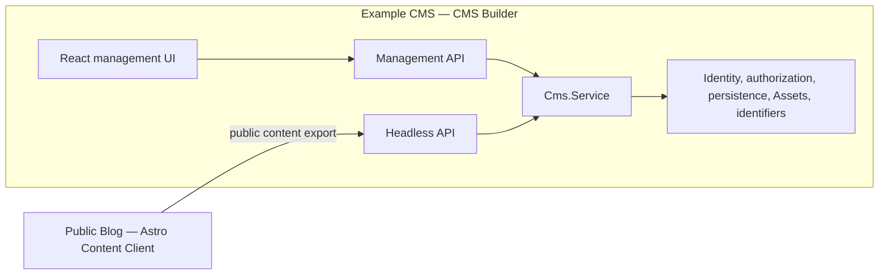

# Nearly Headless CMS


Nearly Headless CMS is an Effect library for CMS Builders who want reusable, presentation-neutral content behavior without adopting someone else's UI, persistence, identity, authorization, transport, Asset storage, or runtime.

This repository contains the publishable library and two reference applications that prove its boundaries end to end. The CMS Builder application composes the library with concrete infrastructure; the Content Client knows only the Headless API.

## What the project provides

The `nearly-headless-cms` package owns the portable parts of a CMS:

- serializable Content Definitions and deterministic compilation;
- validated Entries, Relationships, Assets, and versioned Rich Text;
- bounded queries, projection, expansion, pagination, and stable failure semantics;
- Entry History, optimistic concurrency, atomic mutations, and restoration;
- Definition Catalog evolution and migrations;
- one typed Effect service for CMS operations;
- optional Management and Headless HTTP contracts with OpenAPI 3.1 generation; and
- Effect service seams for every Builder-owned integration.

The CMS Builder retains control of presentation, persistence, authentication, authorization policy, user management, Asset storage, network transport, and the runtime environment. The package does not ship a CMS UI or turn content into a website.

For installation and public API documentation, see the [package README](packages/nearly-headless-cms/README.md).

## Repository architecture



The reference CMS serves its React application, Management API, Headless API, health route, and protected API documentation from one Effect/Bun server. It composes the public CMS service with the Bun filesystem Adapter and application-specific operations.

The Public Blog is an Astro static site. Its build fetches one validated public content export from the running CMS and uses that coherent Snapshot for every generated page, listing, Asset reference, and RSS result. It imports neither the Example CMS nor `nearly-headless-cms`, which keeps the Content Client boundary honest.

## Workspaces

This Bun monorepo intentionally contains exactly three workspaces:

| Workspace | Role | Published? |
| --- | --- | --- |
| [`packages/nearly-headless-cms`](packages/nearly-headless-cms) | Typed, ESM-only Effect library and portable/Bun Adapters | Yes, as `nearly-headless-cms` |
| [`apps/example-cms`](apps/example-cms) | React/Effect/Bun reference CMS Builder application | No |
| [`apps/public-blog`](apps/public-blog) | Astro static Content Client consuming only the Headless API | No |

The package supports portable Bun and Node.js consumers. The monorepo itself uses Bun for dependency management, scripts, builds, tests, and release tooling.

## Get started

Install the pinned dependencies and run the standard repository checks:

```sh
bun install --frozen-lockfile
bun run verify
```

`bun run verify` runs strict linting, TypeScript checks across all workspaces and repository scripts, the Bun test suite, and escape-hatch verification.

### Run the Example CMS

Start the CMS at [http://localhost:3000](http://localhost:3000):

```sh
bun run --cwd apps/example-cms dev
```

The development server initializes the filesystem-backed CMS under `.data/example-cms`, seeds the reference content idempotently, and serves the UI and APIs together. Set `EXAMPLE_CMS_PORT` to use a different port.

### Build and serve the Public Blog

Keep the Example CMS running, then build the static Content Client and serve it at [http://localhost:4321](http://localhost:4321):

```sh
bun run --cwd apps/public-blog build
bun run --cwd apps/public-blog start
```

The build reads from `EXAMPLE_CMS_URL`, which defaults to `http://localhost:3000`. Set `PUBLIC_BLOG_PORT` to change the static server port.

## Development commands

| Command | Purpose |
| --- | --- |
| `bun run build` | Build every workspace |
| `bun run verify` | Run lint, typecheck, tests, and escape-hatch verification |
| `bun run test:unit` | Run focused pure unit suites |
| `bun run test:types` | Verify the public TypeScript package contract |
| `bun run test:contract` | Exercise HTTP and authorization contracts |
| `bun run test:integration` | Exercise composed library and application behavior |
| `bun run test:filesystem` | Exercise the real Bun filesystem Adapter |
| `bun run check:architecture` | Enforce workspace, import, dependency, route, and generated-code boundaries |
| `bun run check:generated` | Verify checked-in generated artifacts are current |
| `bun run acceptance` | Run the complete automated v0.1 acceptance coordinator |
| `bun run release` | Build and verify the exact npm release artifact without publishing it |

Run a workspace command with Bun's `--cwd` option when working on only the package or one application. For example:

```sh
bun run --cwd packages/nearly-headless-cms test
bun run --cwd apps/example-cms typecheck
bun run --cwd apps/public-blog build
```

## Acceptance strategy

The v0.1 release is accepted through traceability from product and architecture decisions to observable evidence—not through a single coverage percentage.

`bun run acceptance` coordinates:

- repository verification, architecture checks, generated-artifact checks, and public type tests;
- contract, integration, and real-filesystem suites;
- real Example CMS and Public Blog processes;
- WebView interaction and visual baselines on macOS; and
- npm package inspection, deterministic builds, README example execution, and clean-consumer smoke tests.

Manual VoiceOver, keyboard, IME, clipboard, cross-browser, JavaScript-disabled, and accessibility protocols remain explicit release-candidate gates. The source of truth is the typed acceptance manifest, with a generated human-readable view in [`docs/acceptance/v0.1.md`](docs/acceptance/v0.1.md).

Read the full [acceptance and verification strategy](docs/v0.1-acceptance-verification-strategy.md) for supported environments, limitations, and evidence ownership.

## Project documentation

- [Package README](packages/nearly-headless-cms/README.md) — installation, concepts, composition, imports, and stability
- [Example application stack decision](docs/example-application-stack-decision.md) — application architecture and technology choices
- [Architecture decision records](docs/adr) — settled repository-wide decisions
- [Filesystem research](docs/research/bun-filesystem-constraints.md) — storage and durability constraints
- [Package release-readiness decision](docs/package-release-readiness-decision.md) — publication guarantees and exclusions
- [Release runbook](docs/releasing.md) — exact artifact verification and npm publication procedure
- [Manual v0.1 checklist](docs/manual/v0.1-release-checklist.md) — human acceptance gates

Issues and specifications are tracked in [GitHub Issues](https://github.com/jeremyc2/nearly-headless-cms/issues).

## Status and compatibility

The project is pre-1.0. Version `0.1.0` establishes the first package, serialization, HTTP, and filesystem compatibility baseline. The package README documents the stability policy for subsequent `0.1.x` releases.

## License

[MIT](packages/nearly-headless-cms/LICENSE)
